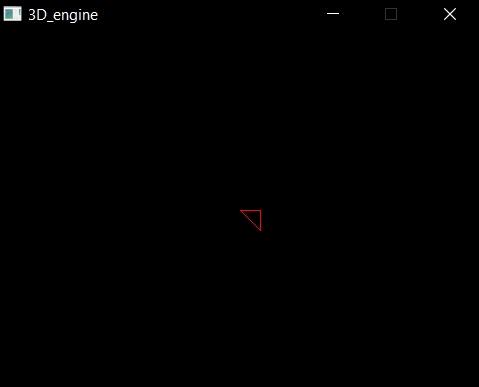

--- Software 3D engine from scratch in C++ using SDL3 libary ---

  # Story:
    I have always loved experimenting in **TurboWarp** (an enhanced, high-performance Scratch compiler that outputs JavaScript). That is where I successfully built my very first 3D mini-engine. 
    Over time, I realized how fascinating this project was and decided to take it to the next level. To truly understand how old-school software rendering works at a pixel-and-memory level — and to deeply master **C++*

  # Tools:
    "Language": C++ (Standard C++17/C++20);
    "Graphics-Libary": SDL3 (Simple Direct Media Layer 3);
    "Compiler": w64devkit;

  # Preview
  

  
  # Road-Map:
    - [x] Envirompent-setup: Configured "w64devkit" and integrate SDL3 libary;
    - [x] FrameBuffer: Successfully allocating memory for pixels; 
    - [x] Line-Drawing: Successfully add first lines to the screen;
    - [ ] Hello-Triangle: ....
    - [ ] Cube: ....
    - [ ] Polygon-Rasterization: ....
    - [ ] Importing 3D model: ....

  # How-to-build
    - If you using windows, run the build.bat;
    - Or write compilation comand: "g++ src\*.cpp -I src -I include lib\libSDL3.dll.a -o build\main.exe";

  # License
  - This project is licensed under the **MIT License**;
"# Retro-Software-3D-Render"
